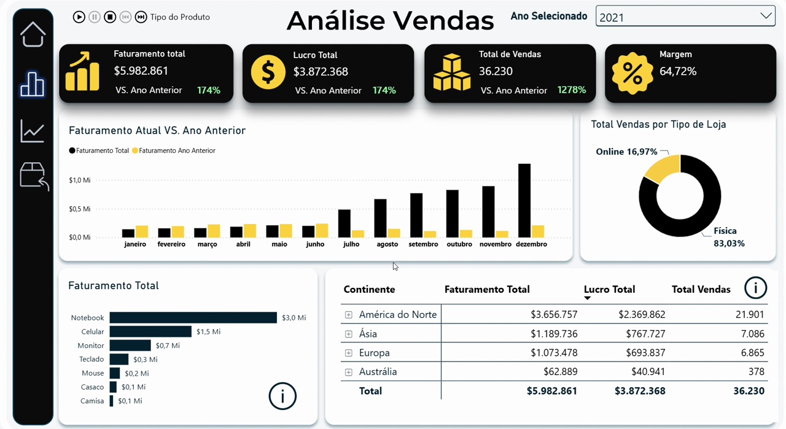
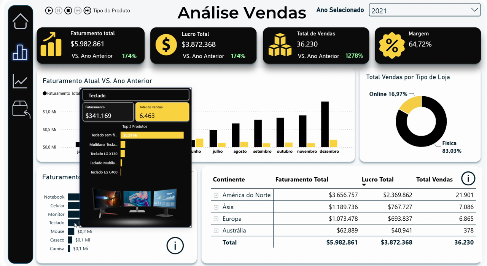
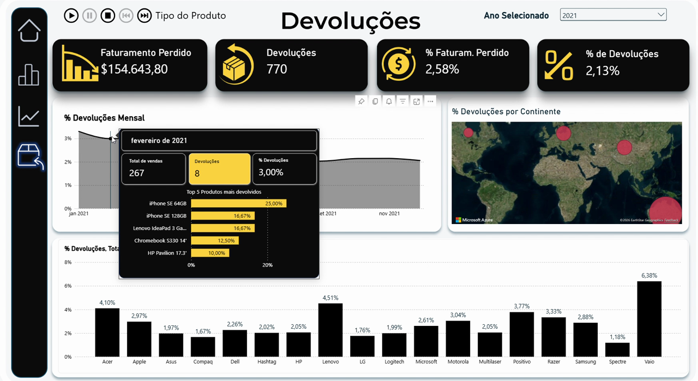

# dashboard-vendas-powerbi

Dashboard de Power BI que analisa vendas, devoluções e margem de uma rede de lojas física e online, com abertura por continente e país e uma árvore de decomposição por marca, tipo de produto e produto.

Fiz esse projeto pra treinar o processo inteiro de BI, não só o resultado visual: extração e tratamento dos dados, modelagem do relacionamento entre as tabelas e escrita das medidas DAX, até chegar no dashboard final. Usei como base as aulas da Hashtag Treinamentos, de onde vem o dataset (uma rede fictícia de loja de eletrônicos), mas boa parte da modelagem, das medidas e do design ficou por minha conta.

## O que tem no dashboard

Três páginas. Análise de Vendas: KPIs de faturamento, lucro, total de vendas e margem, todos comparados com o ano anterior, faturamento por tipo de produto e uma tabela drill-down por continente e país. Uma árvore de decomposição interativa, que deixa escolher entre total de vendas ou faturamento e vai abrindo por marca, tipo de produto e produto específico. E uma página de Devoluções, com faturamento perdido, taxa de devolução por marca e evolução mês a mês.

## Interatividade

Os gráficos têm tooltip customizado: passar o mouse numa barra abre um card com a imagem do produto e o top 5 relacionado, em vez do tooltip padrão só com número.

Também usei um play axis nos KPIs principais: ele passa sozinho por cada tipo de produto a cada 5 segundos, sem precisar clicar em nada. A ideia é a página poder ficar rodando num telão de loja ou de regional, mostrando os números atualizando sozinhos.

Montei ainda um menu lateral com ícone pra cada página (início, análise de vendas, análise avançada e devoluções), que troca de página ao clicar, em vez de depender das abas padrão do Power BI.

## Modelagem

Em vez de criar coluna calculada pra quase tudo, resolvi a maior parte com medida, usando `CALCULATE` e `RELATED`, pra manter as tabelas de fato e dimensão mais limpas e o modelo mais leve. E em vez de deixar as medidas soltas, organizei tudo numa tabela própria, com uma subpasta pra cada tabela de origem (Vendas, Clientes, Lojas, Produtos, Devoluções), assim acho qualquer medida rápido sem precisar abrir a fórmula.

## Números

O modelo trata 56 mil linhas de venda entre 2020 e 2022, 18 mil clientes cadastrados, 306 lojas e 293 produtos.

## Próximo passo

Implementar RLS (row-level security), pra cada gerente regional ver só o dado da própria região ao abrir o relatório. E automatizar a atualização dos anos seguintes, hoje isso ainda é manual.
